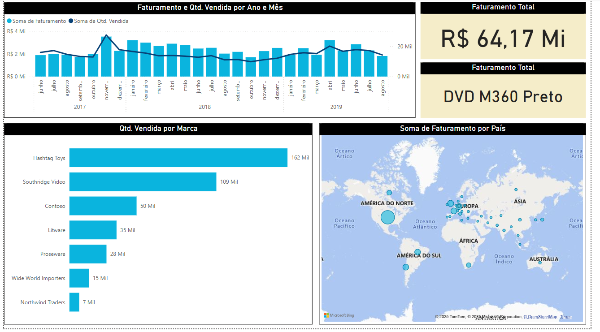
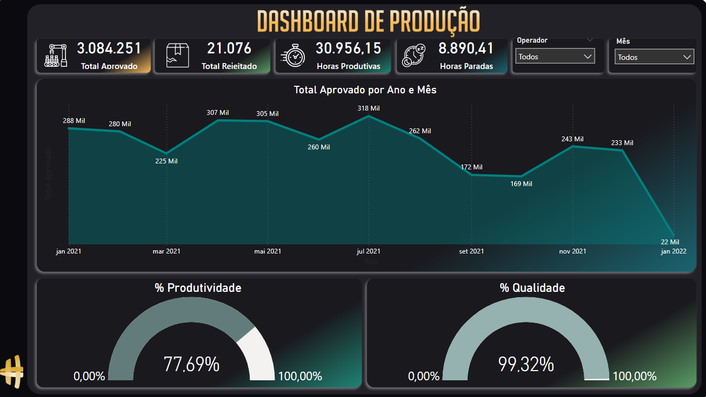
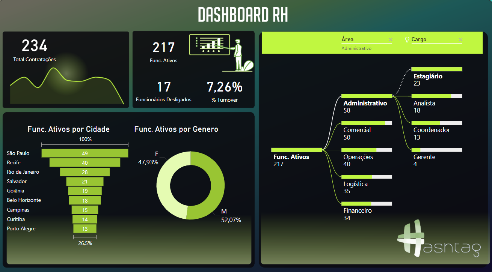
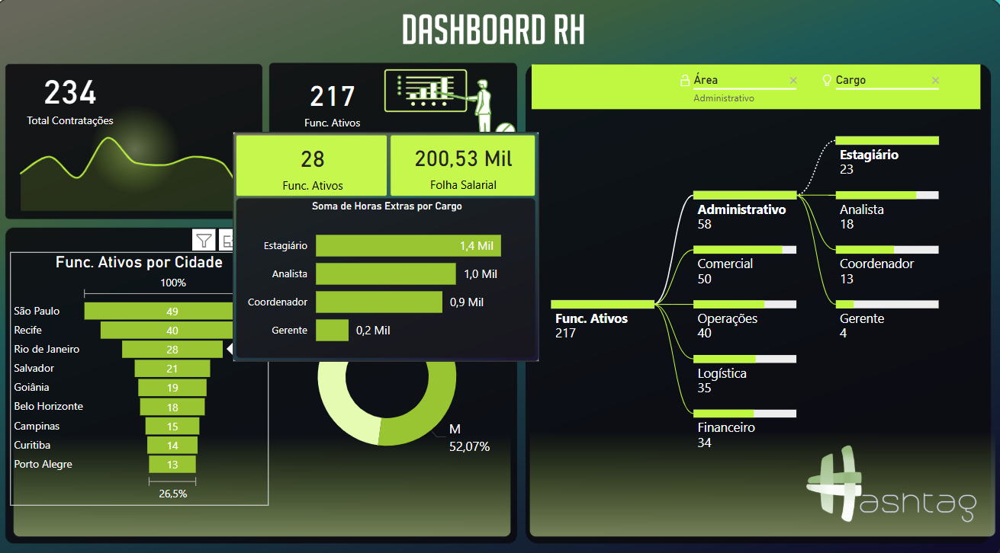
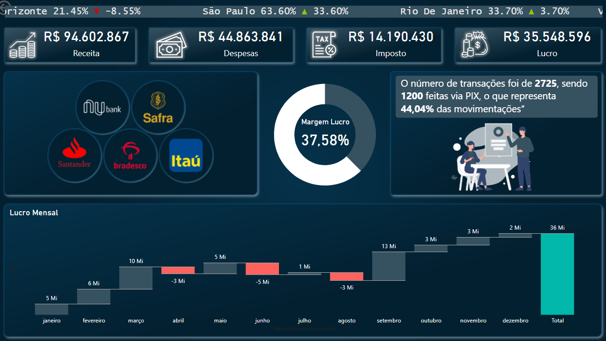

# Dashboards Power BI 

Este repositório contém os projetos desenvolvidos durante o curso intensivo de Power BI da Hashtag Treinamentos. Cada pasta representa um dashboard criado para um setor diferente.

## Estrutura do Repositório

Cada pasta contém:
- O arquivo **.pbix** do Power BI com o dashboard final.
- O arquivo **.xlsx** com os dados utilizados.
- O **plano de fundo** do dashboard (se houver).

## Dashboards Criados

### [Dashboard de Vendas](./Vendas/)
**Objetivo**: Analisar o faturamento, produtos mais vendidos e distribuição geográfica.  

**Gráficos utilizados**:  
- **Colunas e barras empilhadas** 
- **Mapa** 

---

### [Dashboard de Produção](./Producao/)
**Objetivo**: Monitorar produtividade e eficiência da operação.

**Gráficos utilizados**:  
- **Radar** 
- **Linha** 

---

### [Dashboard de RH](./RH/)
**Objetivo**: Acompanhar dados de funcionários, contratações, demissões e turnover.

**Gráficos utilizados**: 
- **Funil**  
- **Rosca**  
- **Árvore hierárquica**
 

---

### [Dashboard Financeiro](./Financeiro/)
**Objetivo**: Monitorar receitas, despesas e lucro da empresa.  
**Gráficos utilizados**:  
- **Cascata**   
- **Rosca** 
- **Scroller**  
- **Storytelling (Enlighten Data Story)**

---

## Tecnologias Utilizadas
- **Power BI** para visualização dos dados.
- **Excel** para armazenamento e manipulação das bases de dados.
- **DAX** para criação de cálculos e métricas.
- **Power Query** para tratamento e transformação dos dados.
